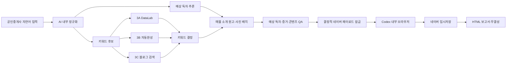

# Naver Realtor Blog Skill

[](https://github.com/Dr-Min/naver-realtor-blog-skill/actions/workflows/validate.yml)
[](LICENSE)

공인중개사와 부동산 중개사무소가 제공한 **매물 사실·현장 관찰·사진**을 바탕으로 네이버 블로그용 매물 소개 글을 만들고, 키워드 조사 근거와 판단 과정을 감사 가능한 형태로 남긴 뒤, Codex 내부 브라우저에서 **임시저장까지만** 수행하는 Agent Skill입니다.

> 이 프로젝트는 “키워드를 많이 넣으면 상위 노출된다”는 식의 SEO 자동화가 아닙니다. 검색량을 추측하지 않고, 네이버 공개 표면에서 확인한 증거와 한계를 분리하며, 매물 사실을 창작하지 않는 반자동 운영 워크플로우입니다.

## 핵심 결과

한 번의 실행은 다음 두 결과를 함께 만듭니다.

1. 사람이 읽고 검토할 수 있는 블로그 원고와 네이버 임시글
2. 입력, 조사, 판단, 반론, QA, 브라우저 실행 결과를 묶은 HTML 감사 보고서

별도의 블로그 미리보기 HTML은 만들지 않습니다. 공개 발행 버튼은 누르지 않습니다.

## 누구를 위한 프로젝트인가

- 개인 공인중개사가 자기 사무소와 실제 매물을 블로그로 알리고 싶을 때
- 매물 사진은 있지만 어떤 제목과 키워드로 글을 써야 할지 모를 때
- AI가 왜 이 키워드와 독자를 선택했는지 검증하고 싶을 때
- 네이버 DataLab, 자동완성, 블로그 검색 화면을 근거로 남기고 싶을 때
- 블로그 편집기에 사진과 캡션까지 넣고 임시저장하고 싶을 때
- 코딩이나 YAML을 모르는 사용자가 자연어 대화만으로 실행하고 싶을 때

## 하지 않는 일

- 검색 상위 노출을 보장하지 않습니다.
- DataLab 상대값을 월간 검색량으로 표현하지 않습니다.
- 매물 정보, 방문 경험, 상담 사례를 창작하지 않습니다.
- 사진만 보고 면적, 입주 가능 인원, 계약 조건을 단정하지 않습니다.
- 네이버 아이디, 비밀번호, 인증번호, 쿠키를 수집하거나 저장하지 않습니다.
- 공개 발행, 예약 발행, 공개 범위 설정, 유료 홍보를 자동화하지 않습니다.
- 댓글, 방문, 추천, 트래픽을 조작하지 않습니다.

## 30초 구조 요약



## 사용자 경험

사용자는 YAML이나 설정 파일을 직접 작성하지 않습니다. 다음처럼 자연어로 답합니다.

> 신촌역 도보 8분 정도이고 단기 월세예요. 보증금 300만 원, 월세 95만 원, 관리비 10만 원입니다. 9월 1일부터 입주 가능하고 사진 세 장을 올릴게요.

AI는 이 답변을 내부 작업 파일로 바꾸고, 빠진 사실만 예시를 들어 추가 질문합니다.

> 관리비 10만 원에 포함되는 항목과 별도 납부 항목을 알려주세요.
> 예: “수도·인터넷 포함, 전기·가스 별도”

예상 독자는 중개사가 반드시 입력하는 값이 아닙니다. AI가 매물 조건과 사진을 바탕으로 가설을 세우고 근거, 반론, 대안, 신뢰도를 함께 기록합니다.

## 전체 실행 단계

| 단계 | 인간이 하는 일 | AI가 하는 일 | 남는 증거 |
| --- | --- | --- | --- |
| 0. 시작 | 스킬 호출 | 날짜/글별 폴더 생성 | 실행 ID, 시작 로그 |
| 1. 입력 | 매물 사실과 사진 제공 | 자연어를 내부 구조로 정규화 | 입력 출처, 누락·제외 목록 |
| 2. 독자 | 없음 | 예상 독자 가설과 반론 생성 | 근거 행렬, 신뢰도 |
| 3. 후보 | 필요하면 강조점 설명 | 키워드 후보 5~10개 생성 | 후보 생성 이유 |
| 3A | 없음 | DataLab 조건·그래프·원본 수집 | 화면, XLSX, URL, 해시 |
| 3B | 없음 | 자동완성 표현 수집 | 화면, 원본, 세션 한계 |
| 3C | 없음 | 블로그 검색 표본 관찰 | 화면, 결과 원본, URL |
| 4. 결정 | 없음 | 선택·기각·반론 기록 | 키워드 결정표 |
| 5. 원고 | 사실 오류가 있으면 수정 | 매물 소개형 원고와 사진 위치 생성 | 읽기용 원고 |
| 6. QA | 필요 시 사실 보충 | 예상 독자·증거·콘텐츠 독립 검수 | PASS/FAIL/BLOCKED |
| 7. 잠금 | 없음 | 브라우저 입력용 순서 고정 | 페이로드와 SHA-256 |
| 8. 로그인 | 세션 만료 시 브라우저에서 직접 로그인 | 로그인 상태만 확인 | 자격정보 없는 상태 기록 |
| 9. 저장 | 없음 | 제목·본문·사진·캡션 입력 후 임시저장 | 저장 전후 확인 |
| 10. 보고서 | 최종 결과 확인 | HTML 보고서와 무결성 확정 | 실행 보고서 |

## 왜 하나의 스킬인가

사용자는 `$naver-realtor-blog` 하나만 호출합니다. 입력, 조사, 원고, QA, 브라우저 저장을 각각 다른 스킬로 외부에 노출하면 실행 순서를 사용자가 이해해야 하고, 서로 다른 원고 버전이 섞일 위험이 커집니다.

내부에서는 책임을 분리합니다.

- 3A·3B·3C 수집자는 서로 독립
- 키워드 결정자는 원본 증거를 수정하지 않음
- 세 QA는 서로 다른 실패를 검사
- 브라우저 담당자는 잠긴 페이로드만 입력
- 보고서 담당자는 잠긴 산출물만 조립

## 실행 모드와 비용 제어

에이전트 역할 10개는 두 모드에서 동일하게 유지됩니다. 기본값은
`efficient`이며, 기존 고비용 구성은 `ultra_precision`으로 보존합니다.

| 모드 | 선택 방법 | 동작 |
| --- | --- | --- |
| `efficient` | 별도 요청이 없을 때 자동 선택 | 저비용 모델, 대화 미상속, 짧은 반환, 스크립트 우선, 문제 역할만 승격 |
| `ultra_precision` | 사용자가 “초정밀”, “최고 성능”처럼 명시 | 기존 high 노력과 sol 중심 QA·판단 구성 |

모든 서브에이전트는 `fork_turns: "none"`으로 실행합니다. 전체 대화 대신
실행 폴더, 필요한 계약 파일, 입력 파일 경로와 SHA-256, 소유 출력 경로만
받습니다. 화면과 원본 파일도 프롬프트에 다시 첨부하지 않고 로컬 경로로
전달합니다. 상세 판단은 파일에 쓰고 채팅 반환은 상태·경로·차단 사유만
10줄 이내로 남깁니다.

`efficient`에서 같은 문제가 두 번 반복되거나 근거가 충돌하고 중요한
표현 판단이 해소되지 않을 때만 해당 역할을 `gpt-5.6-sol high`로 한 번
승격합니다. 브라우저 문제는 sol 대신 `gpt-5.6-terra high`로 재시도합니다.
전체 실행을 자동으로 초정밀 모드로 바꾸지는 않습니다.

## 병렬 에이전트

| 역할 | 기본 모델 | 입력 | 출력 |
| --- | --- | --- | --- |
| DataLab 수집 | `gpt-5.6-luna medium` | 후보군, 필터, 기간 | 3A 원본·화면·결과 |
| 자동완성 수집 | `gpt-5.6-luna low` | 기준 검색어, 세션 상태 | 3B 원본·화면·결과 |
| 블로그 검색 수집 | `gpt-5.6-luna medium` | 검색어, 정렬, 표본 수 | 3C 원본·화면·결과 |
| 키워드 결정 | `gpt-5.6-terra medium` | 잠긴 3A·3B·3C | 선택·기각·반론 |
| 콘텐츠 기획·작성 | `gpt-5.6-terra medium` | 입력, 키워드, 사진, 독자 가설 | 모바일 원고·가독성 검수값·페이로드 |
| 예상 독자 QA | `gpt-5.6-luna medium` | 입력, 사진 관찰, 독자 가설 | 독자 QA |
| 증거 QA | `gpt-5.6-luna medium` | 스크립트 결과, 원본, 화면, URL, 해시 | 증거 QA |
| 콘텐츠 QA | `gpt-5.6-terra medium` | 입력, 원고, 페이로드 | 콘텐츠 QA |
| 브라우저 담당 | `gpt-5.6-terra medium` | 잠긴 페이로드 | 임시저장 결과 |
| 보고서 담당 | `gpt-5.6-terra low` | 잠긴 전체 산출물 | HTML 보고서 |

위 표는 기본 `efficient` 라우팅입니다. 모델을 사용할 수 없으면 같은
비용·역할 계층에서 가장 가까운 모델로 대체하고 실제 모델과 변경 이유를
기록합니다.

자세한 에이전트 프롬프트 계약은 [에이전트 계약](docs/agent-contracts.md)을 참고하세요.

## 키워드 조사 방식

### 3A — Naver DataLab

DataLab은 후보 사이의 상대 추세와 조건별 차이를 관찰하는 데 사용합니다. 필터, 그래프, 범례, 내려받은 원본을 함께 저장하고 원본 수치를 다시 계산합니다.

DataLab의 비율은 월간 검색량이 아닙니다. 절대 검색량 출처가 없으면 `UNKNOWN`으로 기록합니다.

### 3B — 자동완성

자동완성은 실제 사용 표면에 등장한 표현을 발견하는 용도입니다. 순서가 검색량이나 전체 사용자 선호를 의미한다고 해석하지 않습니다. 로그인과 개인화 상태도 한계로 기록합니다.

### 3C — 블로그 검색

현재 블로그 검색에서 반복되는 질문, 형식, 내용의 빈틈을 관찰합니다. 상위 노출은 품질, 방문자, 문의 전환 또는 재현 가능한 순위 공식의 증거가 아닙니다.

자세한 판단 규칙은 [증거와 키워드](docs/evidence-and-keywords.md)를 참고하세요.

## 원고 작성 원칙

실제 매물 입력의 기본 결과는 **매물 소개형 글**입니다. 사용자가 요청하지 않았는데 관리비 계산법이나 지역 일반론 같은 정보형 글로 바꾸지 않습니다.

- 중요한 조건은 이미지 안에만 넣지 않고 본문 텍스트로도 작성
- 장점뿐 아니라 주차, 엘리베이터, 별도 공과금 같은 제약도 표시
- 실제 확인 시각과 확인 주체를 기록
- 키워드 반복 횟수를 목표로 삼지 않음
- 사진은 의미 있는 문단 뒤에 배치하고 정직한 캡션 사용
- 가상 시연이면 제목 또는 첫 문단에서 명확히 고지

### 네이버 모바일 가독성 기본값

- 고지 다음에는 글의 정체와 읽을 이유를 두 줄로 제시
- 가격·관리비·면적·층·입주일·제약은 긴 문장 대신 한 조건당 한 줄
- 소제목은 3–5개를 독립 블록으로 입력하고 본문과 붙지 않게 검증
- 한 문단에는 한 가지 이야기만 쓰며 보통 1–3문장, 35–90자를 목표로 작성
- 140자를 넘는 문단은 법적 고지·정확한 인용 같은 기록된 예외가 아니면 분리
- 관련 설명 다음에 사진을 배치하고 캡션은 보이는 사실 중심의 한 줄로 작성
- 섹션 사이에는 한 번만 여백을 두고, 빈 줄을 여러 개 넣어 길이를 부풀리지 않음
- 섹션마다 굵은 강조는 짧은 구절 하나 이내, 장식용 이모지는 기본적으로 사용하지 않음
- 작성 뒤 문단 길이·소제목 수·조건 목록·사진 간격·붙어쓰기 위험을 별도 검수

## 사진 판단 경계

| 사진에서 볼 수 있는 것 | 사진만으로 단정하면 안 되는 것 |
| --- | --- |
| 침대가 두 개 보임 | 계약상 2인 입주 가능 |
| 창문과 블라인드가 보임 | 남향, 일조 시간 |
| 출입구와 계단이 보임 | 실제 층수, 엘리베이터 유무 |
| 가구·가전이 보임 | 계약에 포함되는 옵션 |
| 공간이 넓어 보임 | 전용면적 |

실제 계약 조건은 중개사가 제공한 최신 확인값으로만 작성합니다.

## 로그인과 임시저장

Codex 내부 브라우저의 지속 세션을 사용합니다.

1. 이미 로그인되어 있으면 다시 로그인하지 않음
2. 세션 만료나 보안 인증이 있을 때만 사용자가 브라우저에서 직접 로그인
3. AI는 아이디·비밀번호·인증번호·쿠키를 요청하거나 저장하지 않음
4. 대상 블로그가 저장된 개인정보 없는 기준과 다르면 중단
5. 잠긴 페이로드와 화면 구조가 일치할 때만 임시저장
6. 공개 발행 관련 화면은 열지 않음

자세한 안전 경계는 [브라우저와 보안](docs/browser-and-security.md)을 참고하세요.

## 실행 폴더

```text
outputs/YYYY-MM-DD/<post-slug>/
├── human/
│   ├── 00-시작.md
│   ├── 01-입력내용.md
│   ├── 02-블로그원고.md
│   ├── 03-실행보고서.html
│   ├── 04-임시저장결과.md
│   ├── photos/
│   └── evidence/
└── ai/
    ├── normalized/
    ├── research/
    │   ├── 3a-datalab/
    │   ├── 3b-autocomplete/
    │   └── 3c-blog-search/
    ├── planning/
    ├── production/
    ├── qa/
    ├── report/
    └── system/
```

사람은 `human/`만 열어도 됩니다. `ai/`는 재현, QA, 해시, 브라우저 입력을 위한 기계 작업 공간입니다.

## 설치

### Skills CLI

```bash
npx skills add Dr-Min/naver-realtor-blog-skill --skill naver-realtor-blog
```

### 수동 설치

```bash
git clone https://github.com/Dr-Min/naver-realtor-blog-skill.git
mkdir -p ~/.codex/skills
ln -s "$(pwd)/naver-realtor-blog-skill/naver-realtor-blog" ~/.codex/skills/naver-realtor-blog
```

### OpenKnowledge

OpenKnowledge의 스킬 가져오기 기능으로 이 저장소와 `naver-realtor-blog` 번들을 선택한 뒤 Codex 위치에 설치할 수 있습니다.

## 실행

```text
$naver-realtor-blog 실제 매물로 새 네이버 블로그 글을 시작해줘
```

또는:

```text
신촌 원룸 사진과 조건을 줄게. 키워드 조사 근거를 남기고 원고를 만든 다음 네이버에 임시저장해줘.
```

## 요구 환경

- Node.js 18 이상: 폴더 생성기와 검증기
- Codex Desktop의 in-app Browser: 네이버 임시저장 단계
- 네이버 로그인: 사용자가 브라우저에서 직접 완료
- 선택 사항: 병렬 에이전트를 지원하는 Codex 환경

브라우저 자동화가 없는 환경에서도 입력, 조사 설계, 원고, QA, 보고서 생성까지 사용할 수 있습니다. 네이버 임시저장 단계만 `BLOCKED`로 기록합니다.

## 로컬 검증

```bash
npm test
npm run audit:public
python3 ~/.codex/skills/.system/skill-creator/scripts/quick_validate.py ./naver-realtor-blog
```

테스트는 새 실행 폴더 생성, 덮어쓰기 거부, 완료 필수 파일, 공개 발행 차단, 자격정보 패턴, Skill frontmatter, 로컬 절대경로와 토큰 유출을 검사합니다.

## 문서

- [아키텍처](docs/architecture.md)
- [전체 워크플로우](docs/workflow.md)
- [에이전트 계약과 프롬프트](docs/agent-contracts.md)
- [증거와 키워드 결정](docs/evidence-and-keywords.md)
- [브라우저와 보안](docs/browser-and-security.md)
- [출력 폴더와 보고서](docs/output-and-report.md)
- [데이터 스키마](docs/schemas.md)
- [테스트와 검증](docs/testing-and-validation.md)
- [공식 출처](docs/official-sources.md)
- [문제 해결](docs/troubleshooting.md)

## 가상 예제

[신촌 가상 단기임대 예제](examples/fictional-sincheon/)는 실제 매물, 실제 사무소, 실제 인물, 실제 문의처가 아닙니다. 사진 대신 단순 SVG 자리표시자를 사용합니다. 공개 저장소에는 사용자가 제공한 실제 사진이나 개인화된 네이버 화면을 포함하지 않습니다.

## 제한 사항

- 네이버 UI가 바뀌면 브라우저 선택자와 검증 방식도 갱신해야 합니다.
- 자동완성은 세션과 개인화 영향을 받을 수 있습니다.
- DataLab 공개 화면만으로 월간 절대 검색량을 얻을 수 없습니다.
- 블로그 검색 표본은 전체 시장이나 전환율을 대표하지 않습니다.
- 이 스킬은 법률, 세무, 계약 검토를 대신하지 않습니다.
- 네이버 노출은 보장되지 않으며 검색 결과는 변할 수 있습니다.

## 라이선스

MIT License. 자세한 내용은 [LICENSE](LICENSE)를 참고하세요.

## 보안 제보

자격정보, 쿠키, 계정 식별자, 개인정보가 저장되는 문제는 공개 이슈에 실제 값을 붙이지 말고 [SECURITY.md](SECURITY.md)의 절차를 따라주세요.
