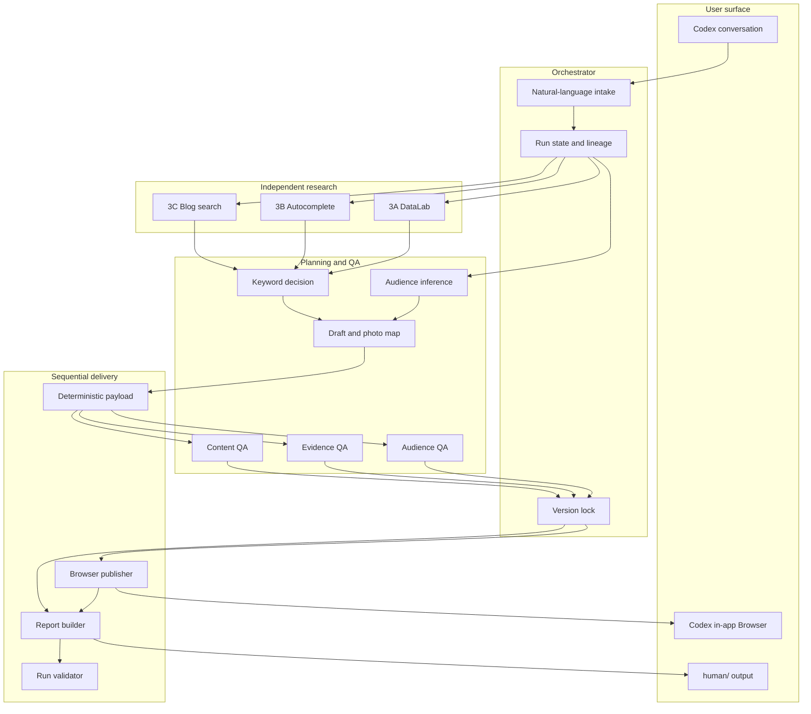
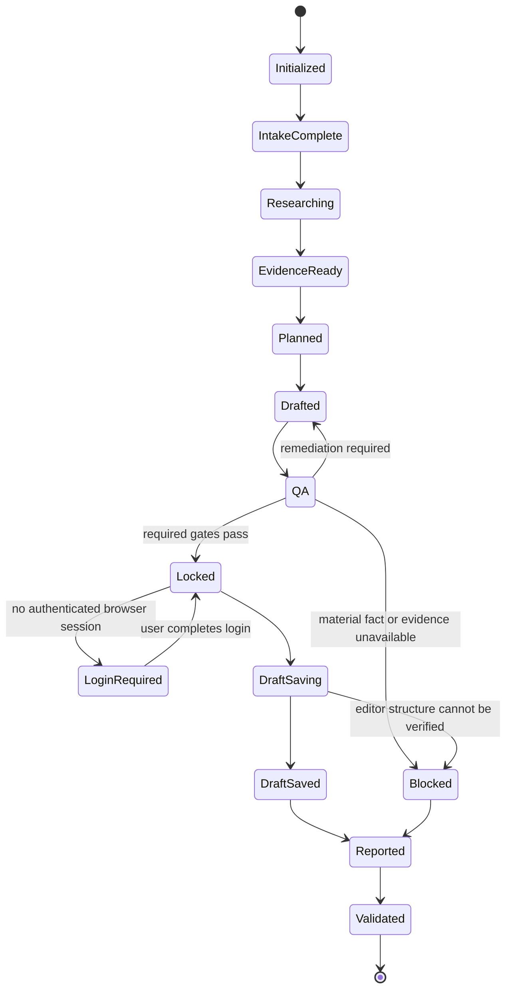
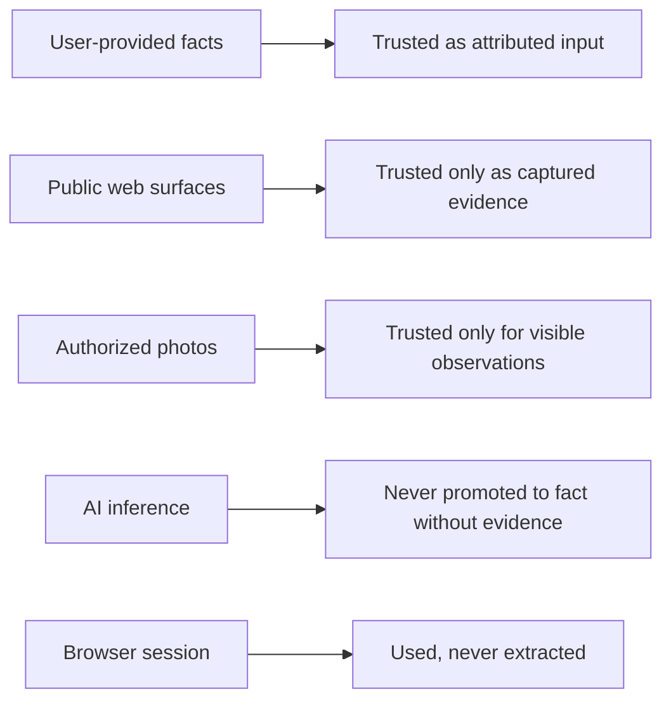

# Architecture

## Design goals

The architecture optimizes for five properties:

1. **non-technical intake** — the realtor answers in natural language;
2. **traceability** — every decision points to evidence and hashes;
3. **version consistency** — the report and browser use the same locked draft;
4. **safe automation** — authentication stays human and automation stops at draft save;
5. **progressive disclosure** — one public skill with internal references and bounded agents.

## Component map



## One skill, multiple responsibilities

The user invokes one skill because the user-visible job is one outcome: make and safely save one post with its evidence report. Internal responsibilities remain separate so that:

- collectors cannot choose the outcome they are measuring;
- decision makers cannot rewrite raw evidence;
- QA cannot silently repair production artifacts;
- the browser writer cannot improvise prose;
- the report cannot use an unlocked draft.

This separation reduces confirmation bias and stale-version errors without making the user orchestrate multiple skills.

## State machine



## Data ownership

| Artifact | Owner | Mutability |
| --- | --- | --- |
| Business profile | orchestrator | update only from user statements |
| Listing facts | orchestrator | update only from user or cited source |
| Photo observations | image mapper | observations only |
| 3A/3B/3C raw evidence | matching collector | immutable after collection |
| Keyword decision | keyword decider | may reference, not modify evidence |
| Readable draft | content producer | mutable until QA lock |
| Naver payload | payload compiler | regenerated from approved content plan |
| QA results | matching QA role | immutable receipt per attempt |
| Browser result | browser owner | append-only result |
| Human report | report builder | built from locked artifacts |

## Trust boundaries



## Deterministic payload

The human draft is optimized for reading. The browser does not parse it heuristically. After QA, the system compiles an ordered payload:

```yaml
title: "exact title"
body_blocks:
  - type: text
    style: notice
    text: "..."
  - type: text
    style: heading
    text: "핵심 조건"
  - type: image
    local_path: "../../human/photos/room-01.svg"
    sha256: "..."
    caption: "..."
public_publish: false
action_after_qa: save_draft_only
```

This prevents heading collapse, duplicated Markdown images, tag reparsing, and report/editor version drift.

## Failure containment

A blocker stops only unsafe downstream actions.

- Missing absolute volume does not stop a limited-evidence keyword decision.
- Missing listing price stops claims that require price and blocks saving if material.
- Unreadable DataLab capture triggers recapture or exclusion; it does not get stretched into the report.
- Expired login pauses browser delivery but preserves completed research and draft files.
- Editor structure mismatch prevents draft save; it does not silently save a malformed post.
- Report renderer failure is recorded and may use a verified semantic fallback.

## Portability

The skill body and research workflow are platform-neutral. The Naver draft-save adapter assumes Codex Desktop's in-app Browser and is intentionally isolated in the browser contract. Other agents can implement a different browser adapter while preserving the payload and safety gates.
