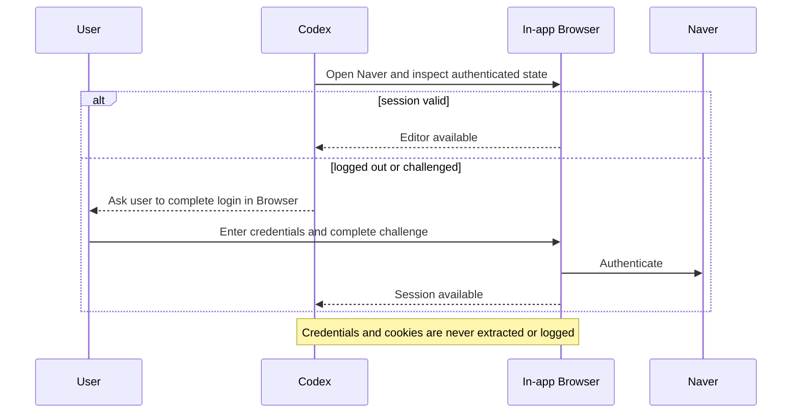

# Browser and Security

## Authentication model

The skill does not automate credential entry. It uses an already authenticated Codex in-app Browser profile.

## Why configuration-file login is prohibited

Saving account IDs, passwords, cookies, or session exports creates a persistent secret that can leak through run folders, logs, reports, Git history, backups, or support bundles. Persistent browser sessions already solve repeated login without exposing these values to the agent.

## Target-blog fingerprint

The workflow may pin a privacy-safe target fingerprint after the first successful draft. It must not be a raw account ID. Suitable signals include a locally hashed combination of non-secret editor characteristics. If the expected and active target differ, stop before entering content.

## Editor ownership

Only one agent may manipulate the Naver editor. Parallel agents may prepare evidence and QA, but they must not share the active editor.

## Structural assertions before save

- exact title visible;
- required disclosure appears first;
- each heading is a separate block;
- core conditions are present;
- text order matches the payload;
- expected image count and order;
- every image has a visible caption;
- tags match;
- no unintended duplicated Markdown image text;
- no publication settings opened.

If the editor concatenates a heading and paragraph, repair and verify it before saving. If repair cannot be verified, stop without saving.

## Allowed and forbidden actions

| Allowed | Forbidden |
| --- | --- |
| open correct editor | enter or retrieve credentials |
| enter locked content | export cookies or browser storage |
| upload authorized images | bypass a security challenge |
| add visible captions | switch accounts without the user |
| click draft save | publish or schedule |
| verify draft confirmation | change visibility or paid promotion |

## Save receipt

Use privacy-safe evidence:

- draft count before and after;
- editor confirmation state;
- timestamp;
- payload hash;
- structural verification booleans;
- retry count;
- publication false.

Do not store raw blog IDs, account names, session values, or screenshots that reveal private navigation unless explicitly redacted and necessary.

## Threat model summary

| Threat | Control |
| --- | --- |
| credential leakage | never request or serialize credentials |
| wrong account/blog | target fingerprint and stop gate |
| accidental publication | deterministic forbidden action and draft-only owner |
| stale content saved | hash lock and payload agreement |
| private photo leak | rights and redaction gate |
| malformed editor structure | assertions before save |
| hidden UI change | bounded retries and BLOCKED result |
