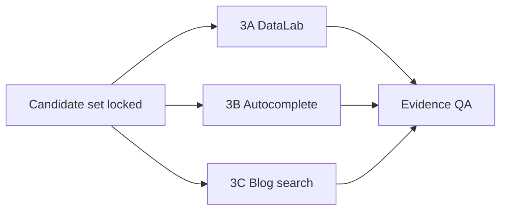
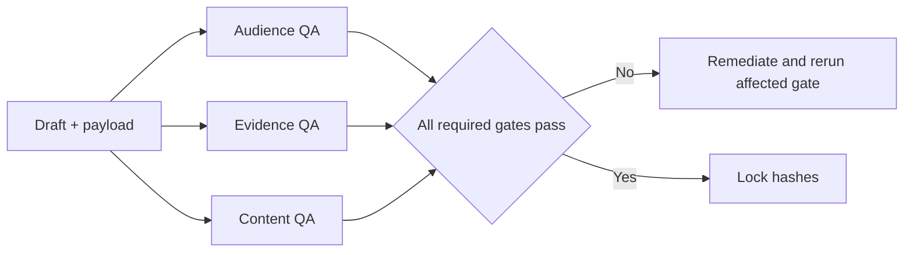

# Complete Workflow

## Phase 0 — Start and scaffold

Run:

```bash
node naver-realtor-blog/scripts/init-run.mjs \
  --root ./outputs \
  --date 2026-08-18 \
  --slug "신촌 단기임대"
```

The script refuses to overwrite a non-empty run folder. It creates the human/AI separation, a run manifest, an append-only event log, and a plain-language start page.

Completion gate:

- one run ID;
- one date/slug directory;
- draft-only policy recorded;
- credential storage false.

## Phase 1 — Natural-language intake

### Interview order

Ask only what is missing:

1. real, fictional demonstration, or informational mode;
2. region, property type, transaction type;
3. availability and verification time;
4. price and included/excluded charges;
5. property specifications and constraints;
6. photo rights and privacy;
7. desired angle and CTA;
8. target blog policy and optional save override.

Do not ask all fields as one intimidating form. Use examples.

### Normalize

Each normalized field carries:

- value;
- source type;
- source timestamp;
- public/private boundary;
- confidence;
- allowed downstream use.

Classify the result:

- usable now;
- missing or ambiguous;
- excluded.

Gate:

- research may continue with some missing fields;
- a claim cannot be written when its source field is unknown;
- draft save is blocked when a material listing fact is unresolved.

## Phase 2 — Photo intake

For each photo:

1. record source and rights statement;
2. make a sanitized working copy;
3. remove geolocation metadata when feasible;
4. inspect visible objects;
5. identify private information;
6. state what the photo cannot prove;
7. assign a proposed placement and caption.

Photo observations and contractual facts stay separate.

## Phase 3 — Audience inference

Audience is an AI hypothesis, not a realtor-required field.

Example:

```yaml
primary_hypothesis: "신촌 생활권에서 가구 구매 없이 단기간 거주할 집을 찾는 1~2인"
confidence: medium
evidence:
  - source: "listing.transaction_type"
    observation: "단기 월세"
    strength: high
counterarguments:
  - "월 고정비가 일부 학생 예산에는 높을 수 있음"
alternatives:
  - "인턴 또는 단기 프로젝트 근무자"
prohibited_claims:
  - "대학생 전용"
```

Gate:

- every audience claim has evidence;
- demographic labels without direct support remain low-confidence;
- the draft uses non-exclusive wording.

## Phase 4 — Candidate generation

Generate 5–10 candidates across:

- region + property type;
- region + transaction type;
- region + verified feature;
- life-area or landmark;
- problem or constraint the listing answers.

Record why each candidate exists. Do not attach guessed search volume.

## Phase 5 — Parallel collection



The three collectors may run in parallel only when they do not fight over the same active browser surface. If the UI cannot be independently owned, serialize screenshot capture.

### 3A completion

- exact filters and keyword groups;
- graph, filter, and legend captures;
- raw workbook;
- source URL;
- hashes;
- recomputed values;
- relative-value limitation.

### 3B completion

- base query;
- returned expressions;
- login and personalization status;
- raw response when permitted;
- screenshot and hash;
- no-volume limitation.

### 3C completion

- Blog tab and sort mode;
- query and time;
- result metadata;
- sampled post reads;
- screenshot and hash;
- no-quality/no-conversion limitation.

## Phase 6 — Evidence QA and keyword decision

Evidence QA checks reproducibility before the keyword decider runs.

The decision record contains:

- observed evidence;
- exact source path and hash;
- listing relevance;
- expected intent;
- answerability;
- risk and counterargument;
- selected/rejected;
- reason;
- evidence that would overturn the decision.

Two modes:

1. **quantitative mode** — a legitimate source reports absolute volume;
2. **limited-evidence mode** — public surfaces support wording and intent but absolute volume is unknown.

Failure to obtain absolute volume never permits fabrication.

## Phase 7 — Content plan

Default to listing showcase when the user supplied a listing.

Plan:

- title candidates and selected title;
- reader question;
- introduction;
- section order;
- verified facts per section;
- photo anchor and caption;
- constraints;
- inferred-audience wording;
- pre-contract checks;
- CTA.

## Phase 8 — Draft and payload

Create:

- human/02-블로그원고.md for reading;
- ai/production/naver-payload.yaml for browser execution.

The payload fixes exact order and content. The browser writer must not re-derive it from Markdown.

## Phase 9 — Independent QA



QA emits PASS, FAIL, or BLOCKED. QA does not silently edit production files.

## Phase 10 — Browser delivery

1. load the locked payload;
2. confirm authenticated session;
3. confirm privacy-safe target fingerprint;
4. open the editor;
5. enter exact title and blocks;
6. upload images at anchors;
7. select images and enter visible captions;
8. verify all structural assertions;
9. click only draft save;
10. record before/after evidence.

If verification is inconclusive, stop without saving.

## Phase 11 — Report and integrity

Build one self-contained HTML report. Then run:

```bash
node naver-realtor-blog/scripts/validate-run.mjs \
  --run ./outputs/2026-08-18/신촌-단기임대 \
  --phase complete
```

The final handoff states:

- human folder;
- selected keyword and evidence mode;
- QA result;
- Naver draft result;
- unresolved limitations;
- validator result.
